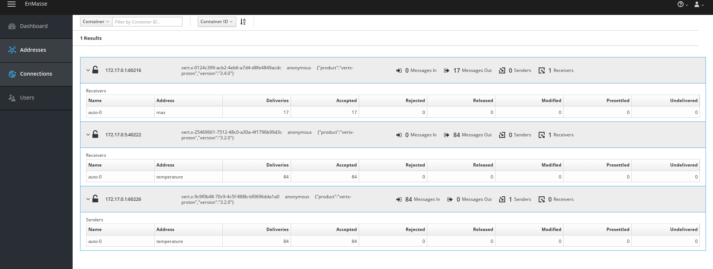
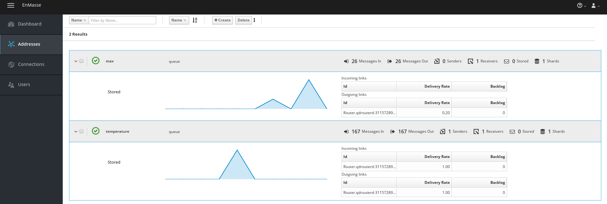

# EnMasse - Spark Streaming demo

This demo shows how it's possible to use a [Kubernetes](https://kubernetes.io/) or [OpenShift](https://www.openshift.com/) cluster running [EnMasse](https://enmasseproject.github.io/) and [Apache Spark](https://spark.apache.org/ in order to have a way for ingesting data through a scalable messaging infrastructure and then processing such data using Spark Streaming jobs.
The proposed IoT scenario is related to an AMQP publisher which sends simulated temperature values and a Spark Streaming job which processes such data in order to get the max value in the latest 5 seconds.

## Prerequisites

The main prerequisite is to have a Kubernetes or OpenShift cluster up and running for deploying EnMasse and the Apache Spark cluster. 

The Kubernetes cluster can be set up locally using [minikube](https://github.com/kubernetes/minikube) project or something like [Azure Container Service](https://azure.microsoft.com/en-us/services/container-service/) for example.

The OpenShift cluster can be set up locally using the `oc` tool as described in the following [guide](https://github.com/openshift/origin/blob/master/docs/cluster_up_down.md).

## Apache Spark

The current repo provides the following resources (in the `spark` directory) for deploying an Apache Spark cluster in _standalone mode_ made of one master node and one worker node.

* _Dockerfile_ : a Docker file for building an Apache Spark image
* _start-common.sh, start-master.sh, start-worker.sh_ : some bash files for starting the master and the worker node
* _spark-master.yaml, spark-master-service.yaml_ : YAML resources files which describe deployment and service for the master node to deploy on Kubernetes
* _spark-worker.yaml_ : YAML resources file which describes deployment for the worker node to deploy on Kubernetes

The above deployment files refer to the ppatierno/spark:2.0 image available on Docker Hub but you can re-build such image using the Dockerfile and then changing the image name in the related deployment files.

> Credits to [this](https://github.com/phatak-dev/kubernetes-spark) project and [this](https://github.com/kubernetes/kubernetes/tree/master/examples/spark) project for definining the above Dockerfile and YAML resources file for deploying Apache Spark on Kubernetes.

## Kubernetes

### Local minikube

> If you have re-built the Apache Spark image and you want to avoid pushing it to the Docker Hub, use the following command `docker save <image> | minikube ssh docker load` for making it available in the Docker images registry which is local to the virtual machine used by minikube.

It's possible that for deploying all this stuff, the default virtual machine size used by minikube (2 CPU cores and 2048 GB of RAM) couldn't be enough so it's better to start minikube with more resources like this.

        minikube start --cpus=4 --memory=4096

In order to deploy the Spark master node and the related service :

        kubectl create -f spark-kubernetes/spark-master.yaml
        kubectl create -f spark-kubernetes/spark-master-service.yaml

With the current deployment, the Spark master service is reachable only inside the cluster (needed by the Spark worker node) but we are not able to submit Spark jobs from outside the cluster (i.e. from the host).
In order to do that we can patch the Spark master service changing its type from _ClusterIP_ to _NodePort_ in the following way :

        kubectl patch service spark-master -p '{"spec" : { "type" : "NodePort" }}'

After that, the Spark master service will expose ports 8080 and 7077 inside the cluster and different ports for being accessible from outside the cluser (node ports are assigned over 30000).
For example, running :

        kubectl get service

The output could be :

        NAME           CLUSTER-IP   EXTERNAL-IP   PORT(S)                         AGE
        kubernetes     10.0.0.1     <none>        443/TCP                         9m
        spark-master   10.0.0.197   <nodes>       8080:32592/TCP,7077:32304/TCP   6m

It means that inside the cluster the Spark master node ports are 8080 and 7077 but from outisde the cluster, using the `minikube` ip address, the exposed ports are 32592 (instead of 8080) and 32304 (instead of 7077).

> For getting the IP address of the virtual machine cluster, the command `minikube ip` can be used.

In order to deploy the Spark worker node :

        kubectl create -f spark-kubernetes/spark-worker.yaml

In order to deploy EnMasse you can follow this Getting Started [guide](https://github.com/EnMasseProject/enmasse/blob/master/documentation/getting-started/kubernetes.md) mainly based on downloading the latest EnMasse release from [here](https://github.com/EnMasseProject/enmasse/releases), unpack it and executing following commands for a manual deployment :

        kubectl create sa enmasse-service-account
        kubectl apply -f kubernetes/enmasse.yaml

After deploying EnMasse, instead of configuring "ingress" resources for accessing the messaging infrastructure outside of the cluster from the host, it's possible to execute the same patch as for the Spark master service, changing from _ClusterIP_ to _NodePort_ for the messaging service. If you want to access using MQTT protocol as well, the same thing should be done for the mqtt service.

        kubectl patch service messaging -p '{"spec" : { "type" : "NodePort" }}'
        kubectl patch service mqtt -p '{"spec" : { "type" : "NodePort" }}'

In this way, other then the default AMQP (5672, 5673) and MQTT (1883, 8883) ports, there will be other node ports useful for reaching such services from outside the cluster.

        NAME                 CLUSTER-IP   EXTERNAL-IP   PORT(S)                                                         AGE
        address-controller   10.0.0.56    <none>        8080/TCP,5672/TCP                                               7m
        admin                10.0.0.54    <none>        55672/TCP,5672/TCP,55667/TCP                                    3m
        kubernetes           10.0.0.1     <none>        443/TCP                                                         1h
        messaging            10.0.0.35    <nodes>       5672:32014/TCP,5671:32661/TCP,55673:32092/TCP,55672:30490/TCP   3m
        mqtt                 10.0.0.125   <nodes>       1883:31674/TCP,8883:30896/TCP                                   3m
        spark-master         10.0.0.197   <nodes>       8080:32592/TCP,7077:32304/TCP                                   1h
        subscription         10.0.0.178   <none>        5672/TCP                                                        3m

In order to have the EnMasse console accessible we need to enable the minikube `ingress` addon.

        minikube addons enable ingress

> This command will spin up an Nginx ingress controller pod for handling ingress

Finally you should see the console at http://<minikube ip>.

### Azure Container Service

In order to use the ACS, the first step is to deploy a Kubernetes cluster following the official [walkthrough](https://docs.microsoft.com/en-us/azure/container-service/container-service-kubernetes-walkthrough).

The big difference compared to the local minikube solution is that the services need to be exposed using the provisioned Azure load balancer, so the same patch is used for changing type from _ClusterIP_ to _LoadBalancer_.

        kubectl patch service spark-master -p '{"spec" : { "type" : "LoadBalancer" }}'

In this case, the Spark master service will have an assigned external IP :

        NAME           CLUSTER-IP     EXTERNAL-IP     PORT(S)                         AGE
        kubernetes     10.0.0.1       <none>          443/TCP                         14m
        spark-master   10.0.201.123   13.74.165.147   8080:31207/TCP,7077:30753/TCP   5m

For EnMasse, a specific YAML file is provided in order to add other services (for messaging, mqtt, ...) which are exposed outside the cluster using the cloud provider load balancer.

        kubectl apply -f kubernetes/addons/external-lb.yaml

So finally the exposed services are the following :

        NAME                          CLUSTER-IP     EXTERNAL-IP      PORT(S)                                 AGE
        address-controller            10.0.194.238   <none>           8080/TCP,5672/TCP                       11m
        address-controller-external   10.0.68.163    52.169.146.241   8080:32595/TCP,5672:31099/TCP           3m
        admin                         10.0.122.222   <none>           55672/TCP,5672/TCP,55667/TCP            11m
        console-external              10.0.196.37    52.169.145.32    56720:32351/TCP,8080:31811/TCP          3m
        kubernetes                    10.0.0.1       <none>           443/TCP                                 31m
        messaging                     10.0.158.202   <none>           5672/TCP,5671/TCP,55673/TCP,55672/TCP   11m
        messaging-external            10.0.253.186   52.164.120.234   5672:31398/TCP,5671:31813/TCP           3m
        mqtt                          10.0.93.42     <none>           1883/TCP,8883/TCP                       11m
        mqtt-external                 10.0.12.156    13.74.150.148    1883:31653/TCP,8883:30343/TCP           3m
        spark-master                  10.0.201.123   13.74.165.147    8080:31207/TCP,7077:30753/TCP           21m
        subscription                  10.0.184.112   <none>           5672/TCP                                11m

Even if node ports are showed with the default ones (i.e. 8080, 5672, 1883, ...), the last ones can be used together with the external IP for accessing services from outside the cluster.

## OpenShift

TODO

## Demo application

The demo application is based on this [AMQP Spark Streaming demo](https://github.com/redhat-iot/amqp-spark-demo) repo where the scenario is the following :

* an AMQP publisher application sends simulated temperature values every seconds to the _temperature_ address
* an AMQP Spark driver application uses the [AMQP Spark Streaming connector](https://github.com/radanalyticsio/streaming-amqp) in order to receive such values from the same _temperature_ address and then executing a Spark job for getting max value in the latest 5 seconds

The above repo describes all the steps for setting up the demo running against an Apache Artemis broker instance using a queue named _temperature_ as destination.

The first needed step is to build the source code application as described [here](https://github.com/redhat-iot/amqp-spark-demo#building-the-demo-source-code).

The current demo use the same AMQP publisher but a modified version for the Spark driver application which doesn't just print the filtered values on the console but sends
them to the _max_ address using AMQP.

Regarding the AMQP publisher application, the _messaging_ service address/port will be specified; the same of the Spark driver other than the right address for the Spark master node.

### Deploying addresses

The demo is about the AMQP publisher which sends temperature values to the _temperature_ address and an AMQP receiver which receives filtered max values (in the latest 5 seconds) from the _max_ address.
This address can be used in a _direct messaging_ fashion or deploying two queues in EnMasse in order to leverage on buffering messages through a broker without pushing so much on the Spark Streaming application.
In order to do that, an addresses JSON description file is provided and can be deployed in the following way :

        curl -X PUT -H "content-type: application/json" --data-binary @./addresses/addresses.json http://<address_controller_ip>:<address_controller_port>/v3/address

Where the values of the `address_controller_ip` and `address_controller_port` depends on where the cluster is deployed (locally with minikube or in the cloud with ACS).

It's possible doing the same using the EnMasse console directly.

### Spark driver application

The `spark-driver` folder provides the above AMQP temperature application (developed in Java) and a Docker image for running the related Spark driver inside the cluster.
This application can be packaged in the following way :

        mvn package -Pbuild-docker-image

After that, the built Docker image can be deployed to the cluster with this command :

        kubectl create -f <path-to-repo>/spark-driver/target/fabric8/spark-driver-svc.yaml

### A view from the EnMasse console

Following picture shows how there is a connection from the publisher on the _temperature_ address sending values, a connection from the final receiver on the _max_ address 
for getting filtered values and finally a receiver (the Spark Streaming driver) on the _temperature_ address as well getting values for streaming analytics.

In this picture, the _temperature_ and _max_ addresses are showed with more information even related to the AMQP links created against them.

